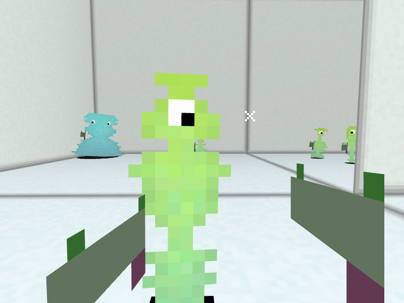
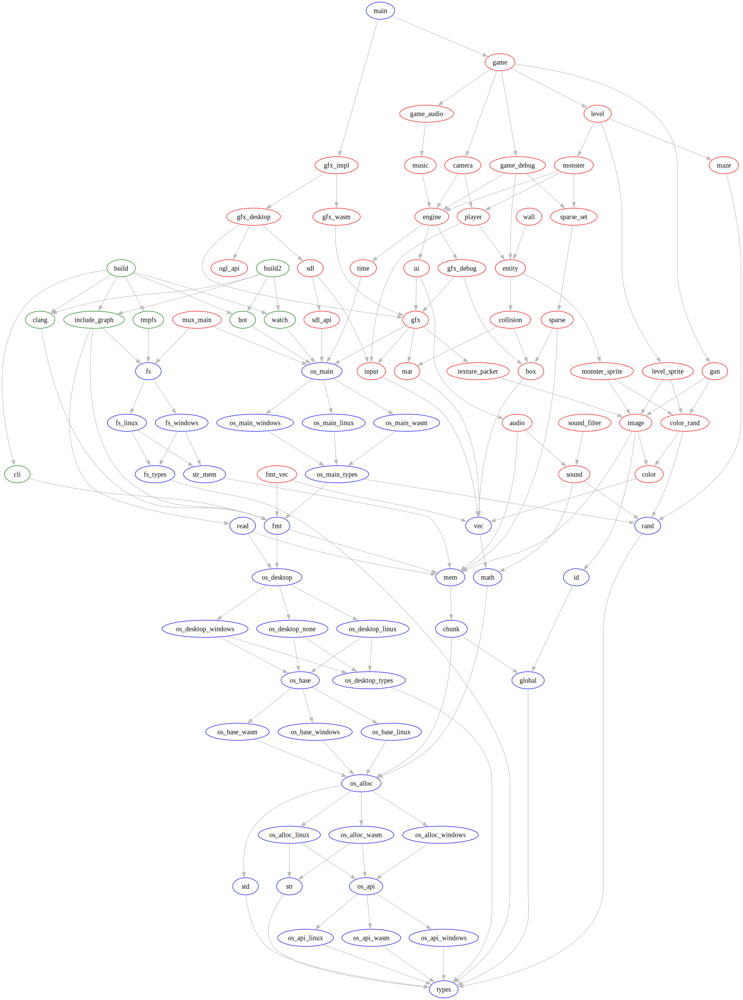

# Quest For Nothing



# Building

Install `clang` and `sdl2`, then run the build script.

```bash
./build linux
```

See `./build` for more options:

```
Usage: ./build <action> [args]...

Actions:
  run <main> [args]... Build and run with hot reloading
  watch                Build all targets and rebuild on every change
  all                  Build all targets
  linux                Build for linux
  windows              Build for windows
  web                  Build for web
  serve                Start a simple local python http server for testing the web version
  release              Build all targets in release mode
  asset                Build asset.h
  format               Format code

Examples:
  ./build run src/main.c
  ./build run src/hot.c watch
  ./build build
  ./build release
  ./build asset
```

# Building windows
For cross compiling to windows you need `mingw-w64`.

```bash
./build windows
```

# Running web version
For cross compiling to windows you need `wasm-ld` which is in the `lld` package on Arch Linux.

```bash
./build web
```

To run the web version start a simple python http server after building. Then navigate to `http://localhost:8000/out`.

```bash
./build serve
```

# Building Manually

Any executable can be compiled with a single 'clang' call.

Each executable is compiled as a single unit, with the platform automatically detected based on the `-target` passed to Clang.

- `clang -o ./out/main src/main.c`
- `clang -o ./out/build src/build.c`

Note that you will need to generate 'asset.h' once using `out/build asset` when compiling the game.

# Hot Reloading

Run `./out/build run src/main.c` to launch the game. Edit any file, and the game will reload while preserving its state.

For GDB, launch with `gdb --args ./out/build run ./src/main.c` and use the `dir` command to update the source view when needed.

# Version 1.0
I'd like to release this someday, so keeping it very simple!

- [x] FPS movement
- [x] Random Aliens
- [x] Random Level
- [x] Sound effects
- [ ] Score
- [ ] Death
- [ ] Music
- [ ] Write Description
- [ ] Publish Promo Images
- [ ] Publish Promo Youtube video (how to play, and how to edit)
- [ ] Publish 1.0 on Itch

# Design
Why only headers and static functions?

- All dependency management is done with `#include`'s.
- Every module is a single `.h` file.
- Compilation is done in one pass, improving build time.
- The compiler optimizes, not the linker. ompiler can inline everything if needed.

How does hot reloading work?
- When a source file changed (and at start):
  1. Recompile as a shared object to a unique path.
  2. Call `update(void **handle)` function

- Don't use globals, they are reset on reload. If needed manually update the global on every reload. (See `OS_GLOBAL`)
- Don't use libc malloc/free, it uses globals. (malloc will work, but free probably not)

# Module structure


