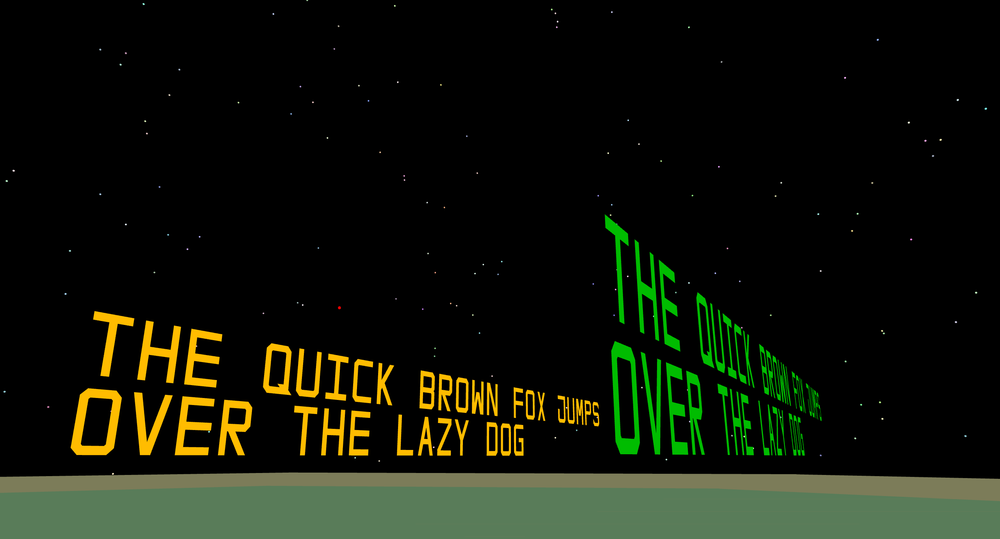

<!-- Copyright (c) 2023 - Tom Smeets <tom@tsmeets.nl> -->
<!-- README.md - Quick introduction to this project -->
# Quest For Nothing

A game entirely developed from scratch in very straightforward and simple C code.

## Game Design
A 3D retro FPS dungeon crawler like game but inside a spaceship.

The universe is a simulation, but it is slowing down.
Your task is to travel the universe and solve this problem.

The actual problem is of course more complex and allows for choices of how it can be solved.
1. Kill all Aliens
2. Turn off all the lights or whatever
3. Tell the aliens lies so that they become more stupid

Some cool mechanics that should be present:
1. Talking to aliens
2. Killing aliens
3. Temporary time slow down tool, that works by doing a very complex computation.

As the simulation speeds up again the aliens become smarter and more diverse.
For a detailed design document see [doc/design.md](doc/design.md).

## Programming
I want to focus on simplicity, all the code should be straightforward.
Simple code is the best code.

For more information see [doc/programming.md](doc/programming.md).

## Documentation
- [Design](doc/design.md)
- [Programming](doc/programming.md)
- [Memory](doc/memory.md)
- [Audio](doc/audio.md)
- [Graphics](doc/graphics.md)
- [Writing](doc/writing.md)

## License
This project is licensed under the [MIT license](LICENSE.txt).
