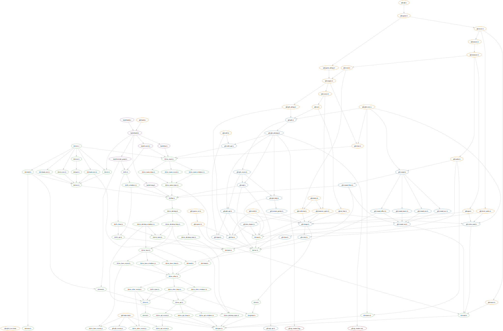

# Quest For Nothing


# Building

Install `clang` and `sdl2`, then run the build script.

```bash
./build linux
```

See `./build` for more options:

```
Usage ./build

Actions:
    run             Run an application with dynamic hot reloading
    format          Run code formatter
    build           Build an executable
    watch           Build an executable and watch changes
    include-graph   Generate Include graph
    serve           Start a simple local python http server for testing wasm builds
    release         Build qfn release
    publish         Upload archive

Examples:
  ./build run src/qfn/qfn.c
  ./build build src/qfn/qfn.c out/main
  ./build release
```

# Building Manually

Any executable can be compiled with a single 'clang' call.

Each executable is compiled as a single unit, with the platform automatically detected based on the `-target` passed to Clang.

- `clang --std=c23 -I src --embed-dir=src -o out/main src/qfn/qfn.c`
- `clang --std=c23 -I src -o out/build src/build/build.c`

# Hot Reloading

Run `./out/build run src/qfn/qfn.c` to launch the game. Edit any file, and the game will reload while preserving its state.

For GDB, launch with `gdb --args ./out/build run ./src/qfn/qfn.c` and use the `dir` command to update the source view when needed.

# Version 1.0
I'd like to release this someday, so keeping it very simple!

- [x] FPS movement
- [x] Random Aliens
- [x] Random Level
- [x] Sound effects
- [x] Music
- [x] Score
- [x] Death
- [ ] Write Description
- [ ] Publish Promo Images
- [ ] Publish Promo Youtube video (how to play, and how to edit)
- [ ] Publish 1.0 on Itch

# Game Design

Inspiration from Chris Crawford:
- [Chris Crawford Video Game Series](https://www.youtube.com/watch?v=ajz_1TqccYA)

## Verb List
What does a player DO?

- shoot
- dodge
- explore
- discover

## Features (based on verb list)
Qfn verb list
- shoot
    - more different interesting guns
- dodge
    - slow bullets
    - telegraph actions
- explore
    - more interesting level design
    - more stations
- discover
    - rare artifacts
    - rare guns
    - secrets

## Story telling
Personality model
- love, trust, fear
- see emotions

Story
- Cause -> Effect
- Fail, user is in control, enrich with cause and effect

# Code Design
Why only headers and static functions?

- All dependency management is done with `#include`'s.
- Every module is a single `.h` file.
- Compilation is done in one pass, improving build time.
- The compiler optimizes, not the linker. ompiler can inline everything if needed.

How does hot reloading work?
- When a source file changed (and at start):
  1. Recompile as a shared object to a unique path.
  2. Call `update(void **handle)` function

- Don't use globals, they are reset on reload. If needed manually update the global on every reload. (See `OS_GLOBAL`)
- Don't use libc malloc/free, it uses globals. (malloc will work, but free probably not)

# Module structure


# Todo
- [x] Turn inside out Platfrom -> Libraries, abstract by composition
- [x] Feature: Player Health, monster shoot player
- [ ] Let desktop decide framerate. (pass dt? or compute?) (??)
- [ ] move gfx -> gfx_api and make gfx.h the implementation
